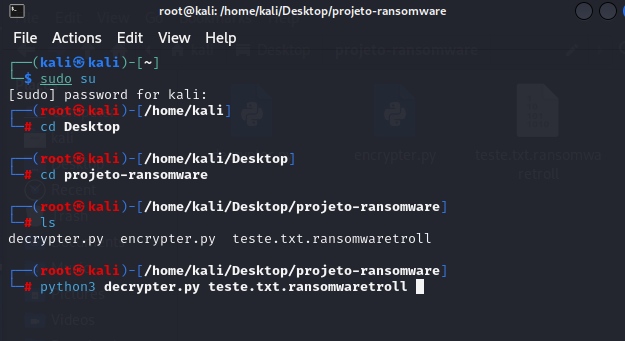

# Criptografia de Arquvos na Prática com Python
Este desafio de projeto faz parte do conteúdo abordado pelo Santander Bootcamp Cibersegurança, realizado pela DIO em parceria com o Santander Universidades.

### Passos a passo:

Download do arquivo encrypter & decrypter e teste.txt
na sequencia, a ação de criptografar (python encripter.py) e depois decriptografar (python decripter.py)

### Resutados

